# Hi there 👋

  <picture>
    <source media="(prefers-color-scheme: dark)" srcset="assets/languages-dark.svg">
    
  </picture>

  <picture>
    <source media="(prefers-color-scheme: dark)" srcset="assets/coding-activity-dark.svg">
    
  </picture>

